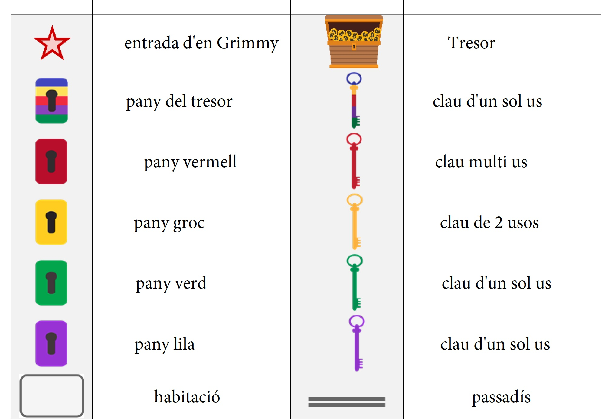
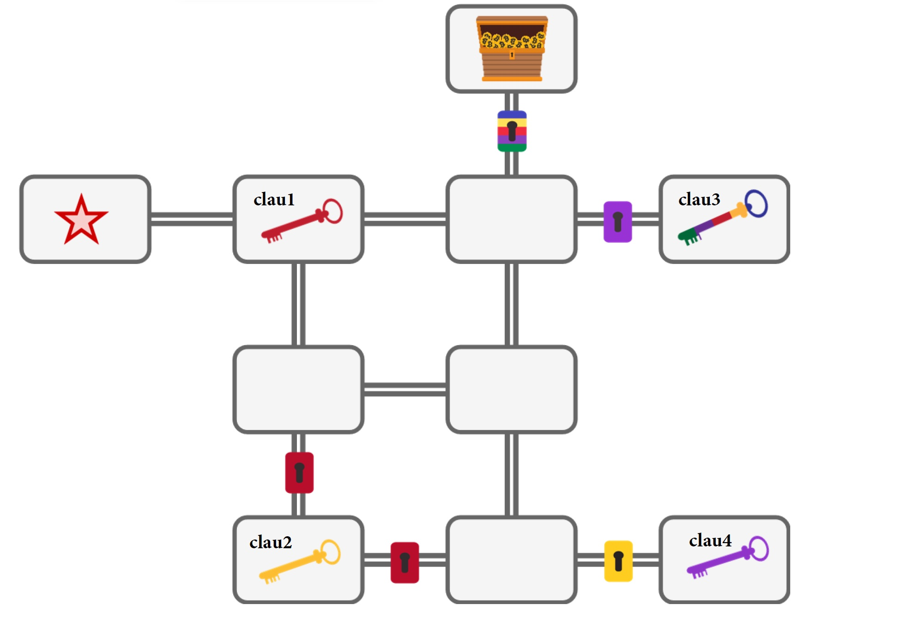
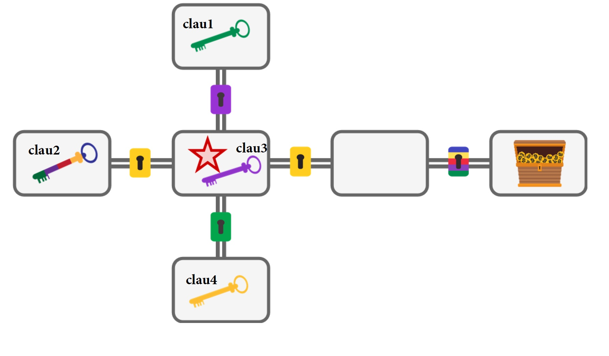
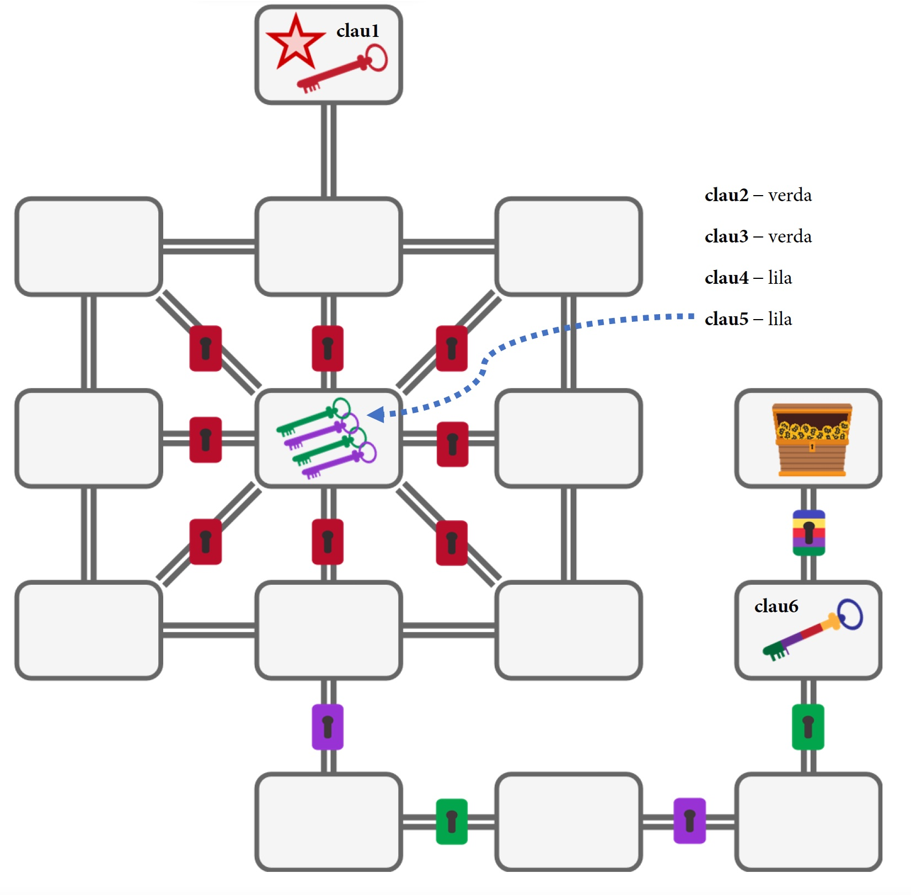

# Pràctica de PDDL
Enunciat i material de la pràctica de PDDL per AI (GEINF-GDDV-GEB)

## Objectiu
Aquesta pràctica té com a finalitat avaluar la vostra comprensió de com modelitzar problemes de planning amb PDDL. L'objectiu és implementar un domini en PDDL i diversos problemes associats a aquest domini.

S'us proporciona una plantilla per al domini i per algun problema a implementar.

## Descripció del Domini – El Caçador de Tresors Grimmy
En Grimmy és un especialista en laberints que tenen tresors de valors incalculables! N'ha trobat de dos tipus:

# Laberints simples

- El laberint conté habitacions connectades per passadissos, que permeten anar d'una habitació a una altra.
- Hi ha passadissos bloquejats amb panys de colors.
- Cada habitació pot estar buida o contenir algunes claus de colors.
- En Grimmy només pot portar una clau a la vegada.
- Una de les habitacions conté el tresor (és l'objectiu).

# Laberints perillosos
- Tenen les mateixes propietats que els bàsics més:
- Alguns passadissos són perillosos i poden ensorrar-se després d'haver-se fet servir (per tant no es pot recular per ells)
- Hi ha claus d'un sol ús, de dos usos i d'ús infinit

El camí no és senzill. Els passadissos poden col·lapsar, les claus estan disperses i no és fàcil trobar un camí òptim fins al tresor. Tot i així, en Grimmy pot dur a terme les accions següents:

1. Moure's a una habitació adjacent sempre que el passadís no estigui bloquejat ni col·lapsat. 
2. Obrir un passadís bloquejat amb la clau adequada.
   - Les claus utilitzades no desapareixen, sinó que es mantenen amb en Grimmy, ara bé, el passadís un cop obert queda obert.
4. Recordeu que en els laberints perillosos:
   - Les claus d'un sol ús només poden ser utilitzades una vegada.
   - Les de dos usos poden ser utilitzades dues vegades.
   - Les  multiús poden ser utilitzades infinites vegades.
   - Els passadissos amb pany vermell són perillosos i col·lapçaran després de ser travessats. 
5. Recollir una clau de l'habitació actual si l'heroi no està portant-ne cap.
6. Deixar una clau a l'habitació actual.

## Problemes a Implementar
Els problemes es defineixen mitjançant els dibuixos proporcionats amb la següent llegenda:

## S'us proposa que implementeu els següents problemes

- Laberint 1
  

- Laberint 2
  

- Laberint 3
  

A més dels problemes proporcionats, heu de crear el vostre propi problema amb *com a mínim* les següents característiques:

- Entre 6 i 9 habitacions.
- Més de 20 accions de moviment requerides.
- Un passadís bloquejat per cada color de pany.

## Lliurament i Avaluació

Termini de lliurament **11 d'abril** inclòs.

Les pràctiques es poden fer en equip de fins a 2 persones.

Per lliurar la pràctica, heu d'incloure els següents fitxers PDDL  en un fitxer `.zip`:

- 1 fitxer del domini adequadament comentat per a laberints simples. Feu servir aquest fitxer com a llavor: [laberint.pddl](laberint.pddl)
- 3 fitxers de problemes pels laberints simples adequadament comentats (4 si feu l'extra). Feu servir aquest fitxer  [p1-lab.pddl](p1-lab.pddl) que serveix de llavor del primer laberint per a completar-lo i modificar-lo convenientment per fer els altres problemes.
- 1 fitxer del domini adequadament comentat per a laberints perillosos. 
- 3 fitxers de problemes pels laberints perillosos adequadament comentats (4 si feu l'extra). 
- Un fitxer `.pdf` amb:
  - Noms i mails dels participants a la pràctica
  - Breu descripció de les contribucions de cada membre del grup.
  - Descripció de la solució proposada:
      - Què signifiquen els predicats utilitzats
      - Què signifiquen les funcions (numèriques) utilitzades
  - Proves d'execució amb els plans trobats (podeu posar captures de pantalla)
  - Explicació de com has trobat els valors que estimarien els heurístics h^+ i h^max per als teus problemes considerant l'estat inicial. Explica com els has trobat i demostra-ho.

### Criteris d'Avaluació:

- Codificació correcta del domini i codificació correcta dels problemes per laberints bàsics : fins a 3 punts
- Creació d'un problema difícil addicional: fins a 1 punt
- Qualitat de la codificació i la descripció de predicats i funcions: fins a 1 punt
- Codificació correcta del domini i dodificació correcta del problemes per laberints perillosos : fins a 3 punts
- Creació d'un problema difícil addicional: fins a 0,5 punts
- Qualitat de la codificació i la descripció de predicats i funcions: fins a 0,5 punts
- Troba els valors que estimarien els heurístics h^+ i h^max per als teus problemes considerant l'estat inicial. Explica com els has trobat i demostra-ho: fins a 1 punt

**El professor podrà demanar una entrevista presencial amb els membres de la pràctica per tal d'aclarir aspectes sobre aquesta i per validar-ne l'autoria íntegre**

### Notes Addicionals:

- Si us podeu estalviar predicats usant quantificadors feu-ho.
- És imprescindible que la vostra solució compili i sigui solucionable amb el solver ENHSP.
- És preferible que al vostre domini i problemes li faltin coses a que no compili i no resolgui res, cas en que la pràctica estarà suspesa.
- RECOMANACIÓ: aneu resolent el problema de forma incremental, p.ex. primer sense claus, després amb claus, després amb claus vermelles (per passadissos perillosos) i finalment per claus amb usos limitats.
  
## Recursos Útils
Es recomana l'ús de Visual Studio Code o [editor.planning.domains](https://editor.planning.domains) per editar PDDL.

